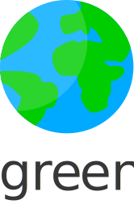

    
     
     
    

     
     

# All things green (and tech for now...)

A collection of collections of [awesome](https://github.com/sindresorhus/awesome) green tech projects.

## Contents

- [Software](#software)
- [Work](#work)

## Software

- [Software](https://github.com/creimers/green-software)

## Work

- [Jobs](https://github.com/creimers/green-jobs)

## Food

- [Wo-ist-markt](https://github.com/wo-ist-markt/wo-ist-markt.github.io)
- [Farmshops](https://github.com/CodeforKarlsruhe/direktvermarkter)

     
     
    

     
     
    

